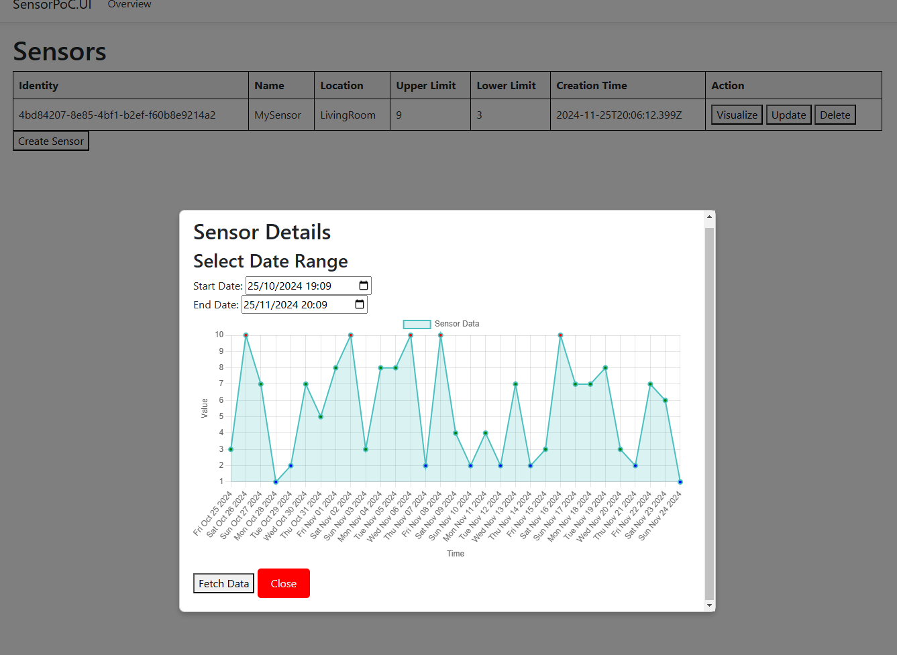

# PoC

## Introduction
IoT became a part of everyday life, and not only indiviuals but companies use it for various reasons. 
The data being collected from these devices can provide metrics that can be used for monitoring and further analysis to improve efficiency as well as mitigating risky situations.
For that in this document we provide a proof of concept how an established company/indiviual having IoT devices could utilize our company for their purposes.

## Objective
Our objective is providing a feasible solution that simulates a sensor data from our side, along with a consumer implementation who utilizes this data. For that a client application is introduced
to visualize the sensor data. As addition, the client platform provides functionalities for managing the sensors such as adding, removing, deleting and overviewing them with certain metadata values which might be useful to categorize certain aspects of sensors.

## Approach

A client application is introduced to demonstrate the management of sensors along with the visualization part in a graph. 
To leverage these requirements for the front-end, a backend application is introduced. Following image provides a list of basic endpoints that the front-end needs:

The front-end application consumes these endpoints to manage sensors and visualize data coming from them.

- An example of an overiew of sensors:

- An example of creation of a sensor:

- An example of update of a sensor:

- An example of deletion of a sensor:

- And finally a visualization of time series data as a graph where red and blue points describe the value went over the provided limits for the sensor:

## Conclusion
We showed here that a plausible solution can be done for an integration with our company with a possible client.
Furthermore, we showed that time-series data can be used to create a graph on a front end application to visualize certain risk points.
An improvement could be that these data coming from our platform are queried regularly and in case of a consistent breach on sensor limits, an alarm could be triggered to mitigate certain risks.
  